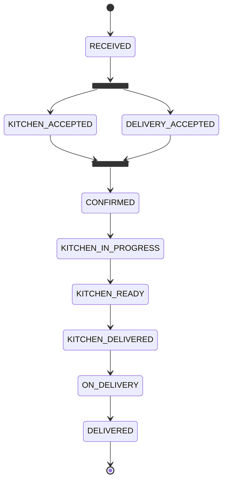

# Getting Started

Source code available at: https://github.com/EDALearn/FoodDeliveryService-KIT-AsyncAPI-In-Action

```shell
git clone https://github.com/EDALearn/FoodDeliveryService-KIT-AsyncAPI-In-Action.git
cd FoodDeliveryService-KIT-AsyncAPI-In-Action
```

After cloning the repository, you can build and run the application using:

```shell
docker-compose -f modulith/src/main/docker/docker-compose.yml up -d
mvn clean install -DskipTests
mvn spring-boot:run -f modulith
```
Then use REST APIs to create/update `customers`, `restaurants`, `orders` and `delivery`.

# Bounded Contexts


## APIs and Models

### ZenWave ZDL Models:

* [models/customers.zdl](https://github.com/EDALearn/FoodDeliveryService-KIT-AsyncAPI-In-Action/blob/main/models/customers.zdl)
* [models/orders.zdl](https://github.com/EDALearn/FoodDeliveryService-KIT-AsyncAPI-In-Action/blob/main/models/orders.zdl)
* [models/restaurants.zdl](https://github.com/EDALearn/FoodDeliveryService-KIT-AsyncAPI-In-Action/blob/main/models/restaurants.zdl)
* [models/delivery.zdl](https://github.com/EDALearn/FoodDeliveryService-KIT-AsyncAPI-In-Action/blob/main/models/delivery.zdl)

## AsyncAPI:

* [customers/src/main/resources/apis/asyncapi.yml](https://github.com/EDALearn/FoodDeliveryService-KIT-AsyncAPI-In-Action/blob/main/modules/customers/src/main/resources/apis/asyncapi.yml)
* [orders/src/main/resources/apis/asyncapi.yml](https://github.com/EDALearn/FoodDeliveryService-KIT-AsyncAPI-In-Action/blob/main/modules/orders/src/main/resources/apis/asyncapi.yml)
* [restaurants/src/main/resources/apis/asyncapi.yml](https://github.com/EDALearn/FoodDeliveryService-KIT-AsyncAPI-In-Action/blob/main/modules/restaurants/src/main/resources/apis/asyncapi.yml)
* [delivery/src/main/resources/apis/asyncapi.yml](https://github.com/EDALearn/FoodDeliveryService-KIT-AsyncAPI-In-Action/blob/main/modules/delivery/src/main/resources/apis/asyncapi.yml)

## OpenAPI:

* [customers/src/main/resources/apis/openapi.yml](https://github.com/EDALearn/FoodDeliveryService-KIT-AsyncAPI-In-Action/blob/main/modules/customers/src/main/resources/apis/openapi.yml)
* [orders/src/main/resources/apis/openapi.yml](https://github.com/EDALearn/FoodDeliveryService-KIT-AsyncAPI-In-Action/blob/main/modules/orders/src/main/resources/apis/openapi.yml)
* [restaurants/src/main/resources/apis/openapi.yml](https://github.com/EDALearn/FoodDeliveryService-KIT-AsyncAPI-In-Action/blob/main/modules/restaurants/src/main/resources/apis/openapi.yml)
* [delivery/src/main/resources/apis/openapi.yml](https://github.com/EDALearn/FoodDeliveryService-KIT-AsyncAPI-In-Action/blob/main/modules/delivery/src/main/resources/apis/openapi.yml)

# Create Order Async Channels


## OrderStatus (Happy Path)




# Bounded Contexts Entities


