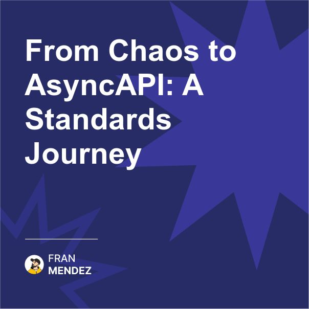

🚀 From chaos to clarity with AsyncAPI.
Standards create freedom, not limitations.
When our event-driven architecture was spiraling out of control, we had to create something new.

In 2015, I was handed what seemed like a dream project: building a product from scratch using event-driven microservices with RabbitMQ. The freedom was exhilarating.

But that freedom quickly turned into chaos.

Messages were flowing everywhere. Services were publishing events that nobody was listening to. Other services were expecting events that never came. Documentation was… well, documentation wasn’t 😅

We were drowning in our own architectural choices.

Nights and weekends, I kept thinking about how to solve this problem. The industry had OpenAPI (formerly called Swagger) for REST APIs, but nothing comparable for event-driven systems.

That's when it hit me - what if we adapted OpenAPI for async communication patterns?

I started small, just a fork of OpenAPI, modifying it to handle pub/sub patterns, message payloads, and the unique characteristics of event-driven systems.

When I showed it to my team, something clicked. Suddenly we could:

- Clearly see which services produced and consumed which events
- Validate message payloads against schemas
- Generate client libraries and documentation automatically
- Onboard new team members faster with clear visual representations

This wasn't just a technical improvement - it changed how we thought about our system. We shifted from individual service implementations to the events and messages that connected them.

I started sharing this work at conferences, expecting polite interest at best. Instead, I found a community of engineers facing the exact same problems.

"This is exactly what we've been missing!"
"We've been trying to build something like this internally!"

That side project became AsyncAPI - now the industry standard for defining event-driven architectures.

The lesson wasn't about the specific technology. 

It was about recognizing that transformative standards come from real-world pain points, not academic exercises.

When you're struggling with a problem that seems fundamental, that's not just frustration - it's an opportunity to create something that might help others beyond your team.

So remember, standards like AsyncAPI don't restrict creativity - they create a foundation that enables it.

They arise from practical problems, not theoretical ones.

If you're struggling with complexity that seems unnecessary, maybe the solution isn't just for you - it might be something the whole industry needs.

What areas of event-driven architecture do you think still need better standards or tools?

Share your pain points in the comments - they might be the next opportunity to create something valuable.

#AsyncAPI #EventDrivenArchitecture #OpenSource #API #Standards #Innovation #TechJourney

Originally posted on LinkedIn: [From Chaos to AsyncAPI: A Standards Journey](https://www.linkedin.com/posts/fmvilas_asyncapi-eventdrivenarchitecture-opensource-activity-7300440413893529600-65VY)

