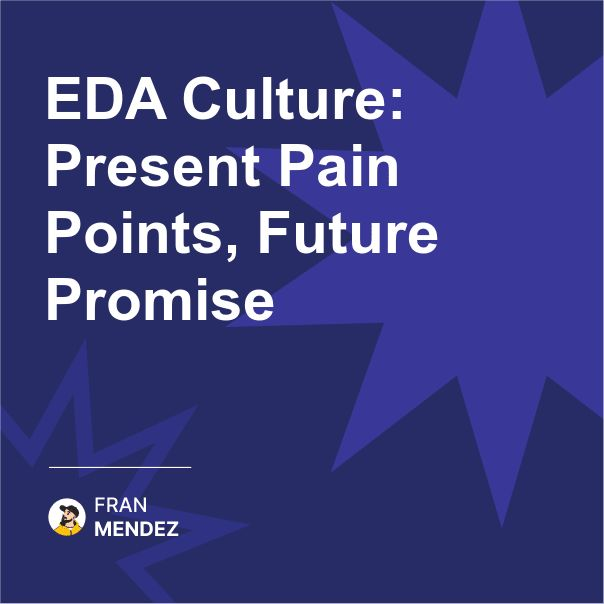

🔄 Your EDA is only as good as your culture.
Technology doesn't fail, culture does.
The gap between today's event-driven struggles and tomorrow's success isn't technical - it's cultural.

Most organizations approach Event-Driven Architecture purely as a technical implementation.

Teams build Kafka clusters, deploy messaging middleware, and start publishing events, but nothing fundamentally changes in how the organization operates.

The symptoms are clear:

- Events are created as afterthoughts, published after database changes
- Event schemas are designed by individual teams with no coordination
- No one can discover what events exist across the organization
- Events reflect system operations, not business semantics
- Teams still think in terms of point-to-point integrations
- Data ownership remains unclear across boundaries

The root cause? The organization's culture hasn't evolved to think in events.

Organizations that thrive with EDA will embrace a fundamentally different cultural mindset.

Here's how the cultural shift looks:

1. Events First, Not Last

Events are byproducts of system operations.

⏬
Events are first-class artifacts designed before the systems that produce them.

2. Shared Event Language

Each team uses their own terminology in events.

⏬
Events use ubiquitous language shared across the organization.

3. Collaborative Event Design

Events are designed in isolation by producing teams.

⏬
Events are designed collaboratively between producers and consumers.

4. Event Stewardship

No one owns the event ecosystem as a whole.

⏬
Dedicated roles ensure event quality, discoverability, and evolution.

5. Event Thinking

Teams think in requests, APIs, and databases.

⏬
Teams think in event streams, state changes, and reactions.

6. Data Sovereignty

Data ownership is ambiguous or centralized.

⏬
Clear domain ownership with events as the boundaries.

The organizations that succeed with EDA won't just be those with the best technology. 

They'll be those who transform their culture to think natively in events.

So remember, the gap between mediocre and exceptional event-driven architectures isn't technical - it's cultural.

Focus on building an event-thinking culture before worrying about which message broker to use.

The future belongs to organizations that don't just implement event infrastructure but fundamentally reshape how they think about and communicate changes across their business.

How is your organization bridging this cultural gap? What's working and what's challenging?

Share your experiences in the comments - cultural transformation stories welcome!

#OrganizationalCulture #EventDrivenArchitecture #DigitalTransformation #EngineeringCulture #TechLeadership #ChangeManagement

Originally posted on LinkedIn: [EDA Culture: Present Pain Points, Future Promise](https://www.linkedin.com/posts/fmvilas_organizationalculture-eventdrivenarchitecture-activity-7301165159400562689-BWZy)

