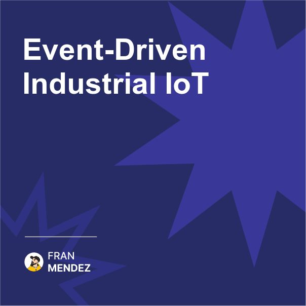

🏗️ How IoT is reshaping industrial automation
The factory floor is becoming event-driven
This transformation is happening faster than you think

I recently toured a manufacturing facility in Badajoz (the city where I live in) that completely changed my perspective on industrial IoT.

What I saw:

Today's IIoT Reality:

* Sensors generating terabytes of event data daily
* Real-time anomaly detection preventing equipment failures
* Predictive maintenance reducing downtime
* Digital twins modeling physical processes
* Event-driven workflows automating responses

The traditional approach to industrial automation was centralized and poll-based. Systems would regularly check equipment status, with significant delays between data collection and action.

The new event-driven approach:

* Equipment publishes events directly
* Edge computing processes critical events locally
* Cloud systems handle aggregation and analytics
* Responses happen in milliseconds, not minutes
* Systems evolve independently without central coordination

The business impact has been staggering:

* Reduction of energy consumption
* Improvement of production throughput
* Reduction of unplanned downtime
* Decrease of quality issues

The key architectural pattern enabling this transformation? The Unified Namespace - a standardized event mesh where all industrial systems publish and subscribe to events using consistent schemas and protocols.

So in short: Industrial IoT is rapidly moving from centralized, poll-based architectures to distributed, event-driven systems. Companies that embrace this shift are seeing dramatic improvements in efficiency, quality, and cost reduction.

Are you working with industrial IoT systems?

Share your experiences in the comments!

#EventDrivenArchitecture #IoT #IIoT #Engineering #Technology #Industry40 #Manufacturing #UnifiedNamespace

Originally posted on LinkedIn: [Event-Driven Industrial loT](https://www.linkedin.com/posts/fmvilas_eventdrivenarchitecture-iot-iiot-activity-7301527480748679169-jA2A)

