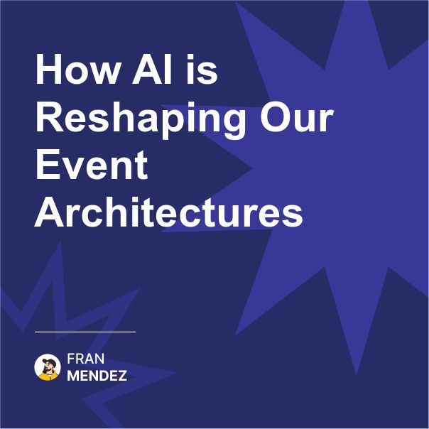

🤖 The AI flywheel effect on Event-Driven Architecture is just beginning.
We're not just integrating AI into our event systems.
AI is fundamentally changing how we design event-driven architectures themselves.

I've been watching an interesting shift in how event-driven architectures are being designed since the rise of advanced AI models. It's subtle but profound.

Traditionally, our event schemas were designed primarily for machine consumption. They were structured, normalized, and optimized for processing efficiency. Human readability was secondary.

But as I observe teams integrating large language models and other AI capabilities into their event-driven systems, I'm noticing a fascinating pattern emerging.

The events themselves are becoming richer, more contextual, and increasingly designed to capture semantic meaning rather than just state changes.

Why? Because AI thrives on context and meaning, not just structured data points.

Here's what I'm seeing in forward-thinking architectures:

1. Events are carrying more contextual metadata - not just what changed, but why it changed and what it means to the business

2. Teams are preserving natural language descriptions alongside structured data - recognizing that text can carry nuances that structured schemas cannot

3. Historical context is being embedded in events - allowing AI to understand the sequence and patterns that led to the current state

4. Semantic relationships between events are being explicitly modeled - creating knowledge graphs rather than just event streams

5. Events are increasingly designed to be self-describing - enabling AI systems to understand new event types without human intervention

This shift isn't just about making AI integration easier. It's fundamentally changing how we think about events themselves.

Events are evolving from simple state change notifications to rich, contextual business narratives. They're becoming the foundation of organizational knowledge, not just integration mechanisms.

The most exciting part is watching how this creates a virtuous cycle. 

As events become richer to support AI capabilities, those same AI systems help make sense of the increasing complexity, suggesting new event types, identifying patterns, and even helping evolve schemas.

So in short, what I'm observing is a fundamental shift in event design philosophy - from events as minimal integration points to events as comprehensive business narratives.

AI isn't just consuming our events; it's changing how we think about them.

The organizations that recognize this shift early will build event-driven architectures that don't just connect systems but create continuously evolving business intelligence platforms.

Are you seeing similar patterns in your organization? How is AI influencing your event design?

Share your observations in the comments - I'm fascinated by how this is playing out in different domains.

#AI #EventDrivenArchitecture #LLM

Originally posted on LinkedIn: [How Al is Reshaping Our Event Architectures](https://www.linkedin.com/posts/fmvilas_ai-eventdrivenarchitecture-llm-activity-7301889871084687360-VMek)

