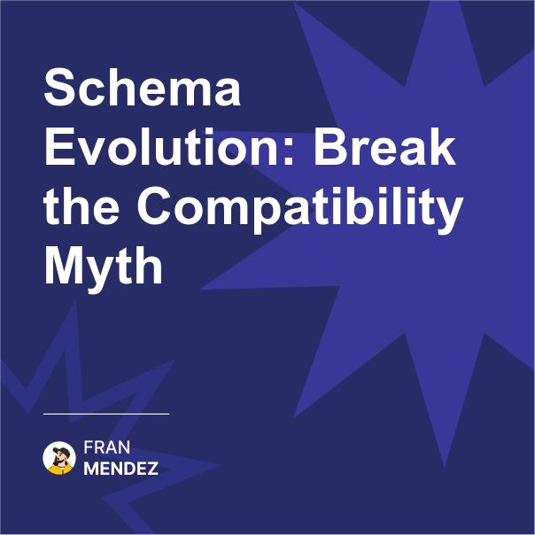

🔄 Schema evolution shouldn't be this hard.
The industry's obsession with immutable schemas is holding us back.
Here's why our current approaches are wrong 👇

Everyone tells you that once an event schema is published, it should never change.

"Add new fields, but never modify existing ones."
"Create a new version for every change."
"Maintain backward compatibility forever."

This conventional wisdom has become dogma. And it's wrong.

Well, not entirely wrong, but fundamentally misguided about how real systems work.

The problem isn't with schema evolution itself, but with our flawed approach to managing it.

Rigid schemas create artificial constraints that don't reflect business reality. Your business processes evolve constantly - why shouldn't your events?

The root issue is that we're applying database thinking to messaging systems. In databases, schema changes are painful because they affect all existing data. But events are immutable records of things that happened - they represent the past, not the present.

Here's what we should be doing instead:

1. Design for evolution from day one. Every schema should expect to change.

2. Separate the logical event (what happened in the business) from its physical representation (the JSON/Avro/Protobuf message).

3. Use semantic versioning for events, but tie versions to business meaning changes, not technical representation changes.

4. Implement runtime schema negotiation between producers and consumers rather than hardcoded compatibility.

5. Build consumers that are resilient to change - extracting only the fields they need and gracefully handling missing or unexpected data.

6. Create infrastructure that can transform events between versions when needed.

7. Adopt a contract-testing approach where consumers express what they need, not what producers must provide.

The greatest systems are those that can evolve without breaking. That doesn't mean avoiding changes - it means designing for change as the constant it truly is.

By embracing schema evolution rather than fearing it, we build systems that can adapt to business needs instead of constraining them.

So remember, rigid schema policies create brittle systems that resist the very changes your business needs to evolve.

Instead of aiming for perfect backward compatibility, aim for graceful evolution where producers can innovate and consumers can adapt.

The best event systems aren't those that never change - they're those designed to change safely.

What's your approach to schema evolution? Do you agree or disagree with this perspective?

Share your thoughts in the comments - I'm genuinely curious about different approaches.

#EventSchemas #EventDrivenArchitecture #SoftwareDesign #EngineeringPractices #DataEvolution

Originally posted on LinkedIn: [Schema Evolution: Break the Compatibility Myth](https://www.linkedin.com/posts/fmvilas_eventschemas-eventdrivenarchitecture-softwaredesign-activity-7302252341288734720-aBfn)

