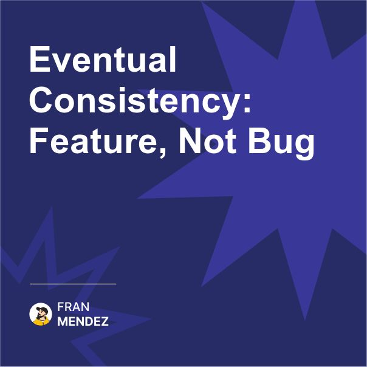

⚡️ Eventual consistency isn't a compromise, it's a superpower.
We've been taught to fear inconsistency like it's a bug.
But what if strongly consistent systems are what's actually holding your business back?

The traditional wisdom says that data inconsistency is dangerous. We're taught that transactions must be ACID. That every read should reflect the latest write. That consistency is paramount.

This mental model served us well when businesses operated at human speed and existed in single locations.

But that world is gone.

Today's digital businesses operate globally, 24/7, at massive scale. They need to respond instantly to user actions. They can't afford to wait for distributed locks or global consensus.

Yet we still design systems as if consistency is the highest virtue, treating eventual consistency as a necessary evil - a compromise we reluctantly make for performance.

This is backward thinking.

Eventual consistency isn't a weakness to be mitigated - it's a pattern that reflects how the real world actually works.

Consider how business operated before computers:

- Sales would make a promise to a customer before checking inventory
- Finance would process payments before orders were fulfilled
- Different departments would work with different, slightly out-of-date information
- Reconciliation was a normal business function, not an error condition

Humans intuitively understand and work with eventual consistency. We do it every day.

By embracing eventual consistency as a fundamental design principle rather than a compromise, we unlock system designs that:

- Scale without artificial bottlenecks
- Continue functioning during partial outages
- Allow different components to evolve independently
- Enable truly global operations without speed-of-light limitations
- Match how business stakeholders actually think about their processes

The key insight: Consistency requirements should be driven by business needs, not technical purism.

Some operations genuinely need immediate consistency. Many more don't. 

Mature system design means understanding the difference and applying the right pattern to the right problem.

The organizations winning at scale aren't those with the most consistent systems - they're those that understand exactly how much consistency each business process actually requires.

So remember, eventual consistency isn't a compromise we make because distributed systems are hard - it's a powerful pattern that reflects how businesses naturally operate.

Instead of fighting against it, design systems that embrace it where appropriate, with compensating mechanisms for handling temporary inconsistencies.

The question isn't "how do we make everything consistent?" but "what level of consistency does each business process actually require?"

Have you embraced eventual consistency in your systems or are you still fighting it?

Share your experiences in the comments 👇 

#EventDrivenArchitecture #SoftwareArchitecture

Originally posted on LinkedIn: [Eventual Consistency: Feature, Not Bug](https://www.linkedin.com/posts/fmvilas_eventdrivenarchitecture-softwarearchitecture-activity-7302614718311985152-Vpp5)

