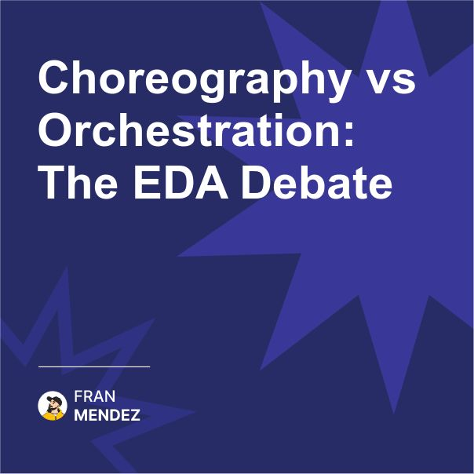

🔄 Choreography vs Orchestration: The dance of microservices
One approach empowers teams, the other centralizes control.
Choose wrong and your architecture will collapse under its own weight.

I've seen too many teams blindly choose orchestration because it feels safer. Let me explain why that might be a mistake.

Orchestration:

* Central coordinator controls the entire process
* Clear visibility of workflow status
* Easier to implement complex error handling
* Creates a single point of failure
* Tightly couples services together
* Becomes a development bottleneck

Choreography:

* Services react to events autonomously
* True decoupling between services
* Teams can innovate independently
* More complex to monitor end-to-end
* Harder to track process completion
* Requires mature event management

Here's what I've learned after implementing both approaches:

Choose Orchestration when:

* You need strict process control
* Transactions must complete in a specific sequence
* Visibility of the entire process is critical
* Teams are less experienced with event-driven patterns

Choose Choreography when:

* Service autonomy is a priority
* Teams need to evolve independently
* You want to minimize cross-team dependencies
* Your organization values innovation speed

The reality? Most mature systems use a hybrid approach. Critical processes use orchestration, while day-to-day operations use choreography.

So remember: This isn't just a technical decision - it's about how your teams will collaborate. Choreography enables autonomy but requires maturity. Orchestration provides control but creates dependencies.

Which approach do you prefer and why?

Share your experiences in the comments below!

#EventDrivenArchitecture #Microservices #SystemDesign #Engineering #Technology #Choreography #Orchestration #TechDebate

Originally posted on LinkedIn: [Choreography vs Orchestration: The EDA Debate](https://www.linkedin.com/posts/fmvilas_eventdrivenarchitecture-microservices-systemdesign-activity-7303339523852132352-2otn)

