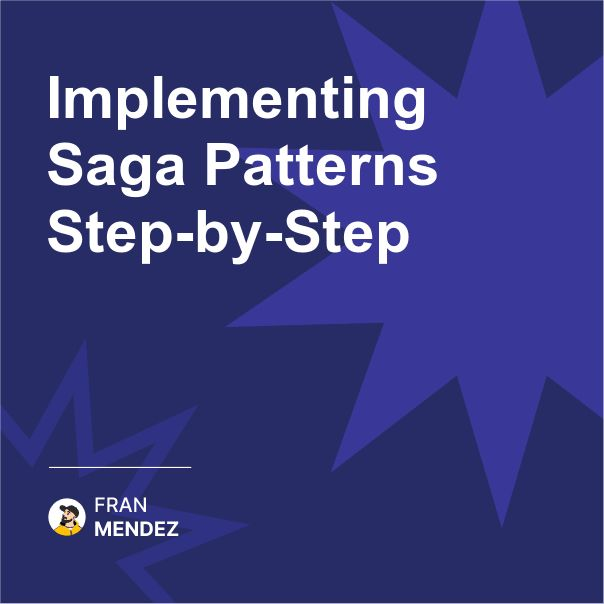

🧵 Saga patterns saved our distributed transactions.
Maintaining data consistency across microservices is hard.
Here's how to implement Saga patterns to solve this challenge step-by-step.

When you break a monolith into microservices, you lose the ability to use ACID transactions across service boundaries. This can lead to partial updates and inconsistent data - a nightmare for critical business operations.

Saga patterns provide a solution by coordinating a sequence of local transactions, each in its own service, with compensation actions to handle failures.

Here's how to implement them in your system:

1. Identify Transaction Boundaries

Map out business operations that span multiple services. For example, an e-commerce order might touch order, payment, inventory, and shipping services.

2. Choose Your Saga Coordination Strategy

There are two main approaches:

Choreography: Services publish events that trigger the next step in other services. Simpler to start with but can become harder to track as complexity grows.

Orchestration: A central coordinator (the Saga orchestrator) explicitly directs each step and handles responses. More structured but introduces a potential single point of failure.

3. Design Compensation Actions

For each step in your saga, define a matching compensation action that can undo its effects if a later step fails.

Example: If a payment is processed but inventory allocation fails, you need a refund compensation action.

4. Implement Idempotence

Ensure that each step can be safely retried without causing duplicate effects. Use unique identifiers for operations and track their status.

5. Handle Timeouts and Partial Failures

Decide timeout periods for each step and what should happen if services are unresponsive.

6. Maintain Saga State

Persist the progress of each saga to survive process or service restarts. This is essential for reliability.

7. Add Monitoring and Visibility

Implement logging that allows you to track saga execution across services. Consider a central dashboard showing in-progress and failed sagas.

8. Test Failure Scenarios

Deliberately cause failures in each step to verify compensation actions work correctly. Chaos engineering practices are valuable here.

9. Start Simple, Then Expand

Begin with orchestration for critical paths where visibility is important. Use choreography for simpler interactions. You can mix approaches in the same system.

So remember, sagas aren't just an architectural pattern - they're a business continuity strategy for distributed systems.

Start by identifying critical cross-service transactions, implement compensation for every action, and ensure visibility into the process state.

The goal isn't perfection, but resilience - systems that can recover from partial failures gracefully.

What's your biggest challenge when implementing distributed transactions?

Drop your questions in the comments 👇 

#EventDrivenArchitecture #SoftwareArchitecture

Originally posted on LinkedIn: [Implementing Saga Patterns Step-by-Step](https://www.linkedin.com/posts/fmvilas_eventdrivenarchitecture-softwarearchitecture-activity-7303701811427762176-ixen)

