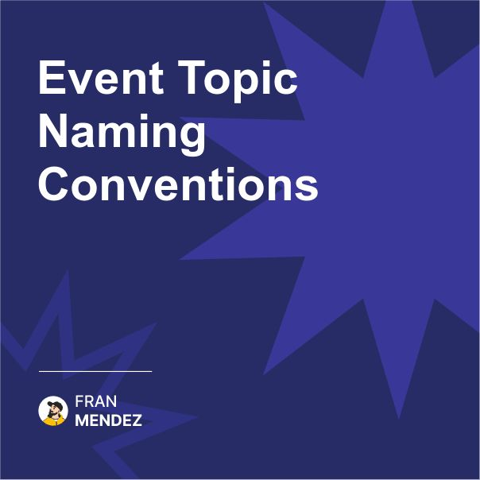

🔑 5 Topic Naming Conventions that prevent chaos
Your future self will thank you for getting this right
The difference between maintainable and nightmarish event systems

After inheriting several messy event-driven systems, I've developed these topic naming conventions that have saved countless hours of confusion:

1. The Domain-First Pattern

* Format: <domain>.<entity>.<event>
* Example: payment.invoice.created
* Why it works: Organizes events by business domain

2. The Ownership Pattern

* Format: <team>.<service>.<event>
* Example: checkout-team.payment-processor.payment-received
* Why it works: Clear ownership and responsibility

3. The Versioned Pattern

* Format: <domain>.<entity>.<event>.v<version>
* Example: inventory.product.updated.v2
* Why it works: Explicit versioning in the topic name

4. The Environment-Aware Pattern

* Format: <env>.<domain>.<entity>.<event>
* Example: prod.order.shipment.dispatched
* Why it works: Prevents cross-environment confusion

5. The Action-Oriented Pattern

* Format: <entity>.<past-tense-verb>
* Example: order.placed, payment.processed
* Why it works: Clearly communicates what happened

Whichever pattern you choose, consistency is key. Document your convention and enforce it through automation, not manual reviews.

And remember - changing topic naming conventions in a running system is painful. Invest time upfront to get it right.

So in short: Topic naming isn't just an aesthetic choice - it's a critical architectural decision that affects discoverability, maintenance, and system evolution. Choose a convention that reflects your organizational structure and stick to it.

What naming convention do you use for your event topics?

Share your approach in the comments!

#EventDrivenArchitecture #Engineering #Technology #BestPractices #SystemDesign #Kafka #Messaging #NamingConventions

Originally posted on LinkedIn: [Event Topic Naming Conventions](https://www.linkedin.com/posts/fmvilas_eventdrivenarchitecture-engineering-technology-activity-7304064192993529856-hZEb)

