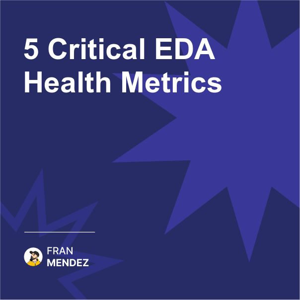

📊 5 metrics that reveal your EDA is failing
Most teams track the wrong numbers.
The warning signs appear long before the system crashes…

After almost a decade researching and talk about event-driven systems, I've identified these five metrics that consistently predict problems:

1. Event Processing Lag

Not just average lag, but the 95th percentile. If this number is growing week over week, you're heading for trouble.

2. Dead Letter Queue Growth Rate

A healthy system has a stable or decreasing DLQ. If yours is growing, you have design issues that need addressing.

3. Schema Evolution Frequency

Too frequent changes (more than 2-3 per month per event type) indicate poor initial design. Too few changes (less than quarterly) suggest your events aren't evolving with your business.

4. Consumer-to-Producer Ratio

Ideally 3:1 to 5:1. Higher ratios create bottlenecks if you don’t take governance seriously; lower ratios indicate underutilized events.

5. Event Replay Frequency

If teams frequently need to replay events, your system isn't delivering reliable processing the first time.

How to use these metrics:

* Track them weekly, not just monthly
* Set alerts for significant changes
* Analyze trends, not just absolute values
* Compare across different event types
* Use them in team retrospectives

So remember: The health of your event-driven architecture isn't measured by uptime alone. These five metrics provide early warning signs that can help you address issues before they become critical failures.

What metrics do you track for your event-driven systems?

Share your dashboard setup in the comments!

#EventDrivenArchitecture #Engineering #Technology #Metrics #Monitoring #SystemDesign #TechLeadership

Originally posted on LinkedIn: [5 Critical EDA Health Metrics](https://www.linkedin.com/posts/fmvilas_eventdrivenarchitecture-engineering-technology-activity-7304426581043691520-spfJ)

